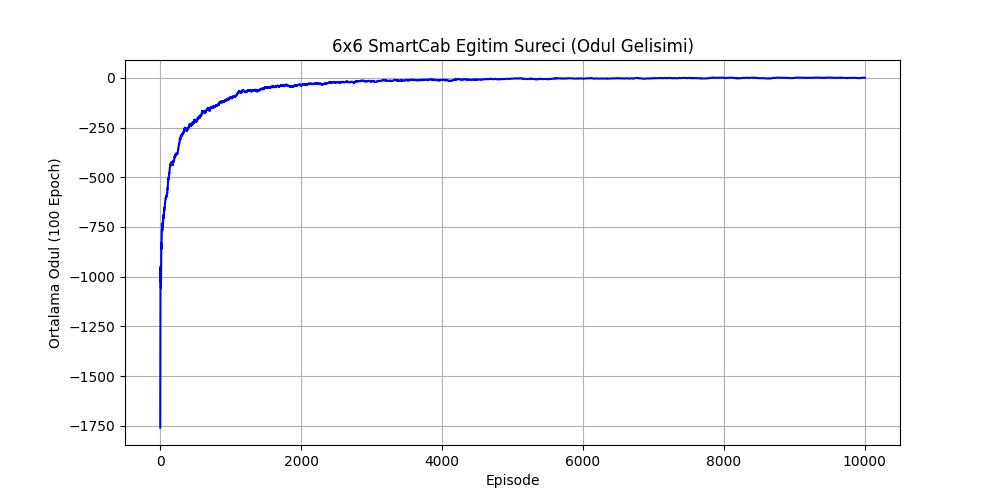
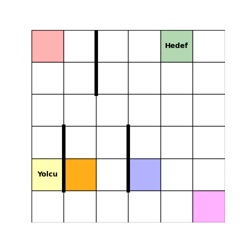

# 6x6 SmartCab: Deep Reinforcement Learning with Q-Learning

Bu proje, OpenAI Gym altyapısı kullanılarak standart `Taxi-v3` ortamının sınırlarının genişletildiği, 6x6 grid tabanlı ve 5 farklı hedef noktasına sahip özel bir otonom taksi navigasyon simülasyonudur. Ajan (agent), Q-Learning algoritması kullanarak yolcuları en kısa sürede, engellere çarpmadan hedeflerine ulaştırmayı öğrenir.

## Özellikler
* **Genişletilmiş Ortam:** Orijinal 5x5 yapı yerine, 6x6'lık bir harita.
* **Hedef Noktaları:** Yolcu alma/bırakma durakları 4'ten 5'e (R, G, Y, B, M) çıkarılmıştır.
* **Durum Uzayı (State Space):** Toplam 1080 farklı durum (6 satır × 6 sütun × 6 yolcu durumu × 5 hedef).
* **Aksiyon Uzayı (Action Space):** 6 hareket (Güney, Kuzey, Doğu, Batı, Yolcu Al, Yolcu Bırak).

## Eğitim Sonuçları ve Performans

Model 10.000 epoch boyunca eğitilmiş olup, ödül (reward) gelişimi aşağıdaki grafikte sunulmuştur. Ajan, başlangıçtaki keşif (exploration) aşamasından sonra hızla optimal politikaya (exploitation) geçerek ödülünü maksimize etmiştir:



Eğitim sonucunda ajanın engelleri aşarak yolcuyu hedefe ulaştırdığı test simülasyonu:



## Kurulum ve Kullanım

Bu proje Jupyter Notebook ortamında geliştirilmiştir. İncelemek veya kendi bilgisayarınızda çalıştırmak için:

1. Repoyu klonlayın:
   ```bash
   git clone https://github.com/enessahin450/6x6-SmartCab-RL.git
   ``` 
2. Gerekli kütüphaneleri yükleyin (gym, numpy, matplotlib, imageio).
3. taxi_6x6.ipynb dosyasını açarak hücreleri sırasıyla çalıştırın.
